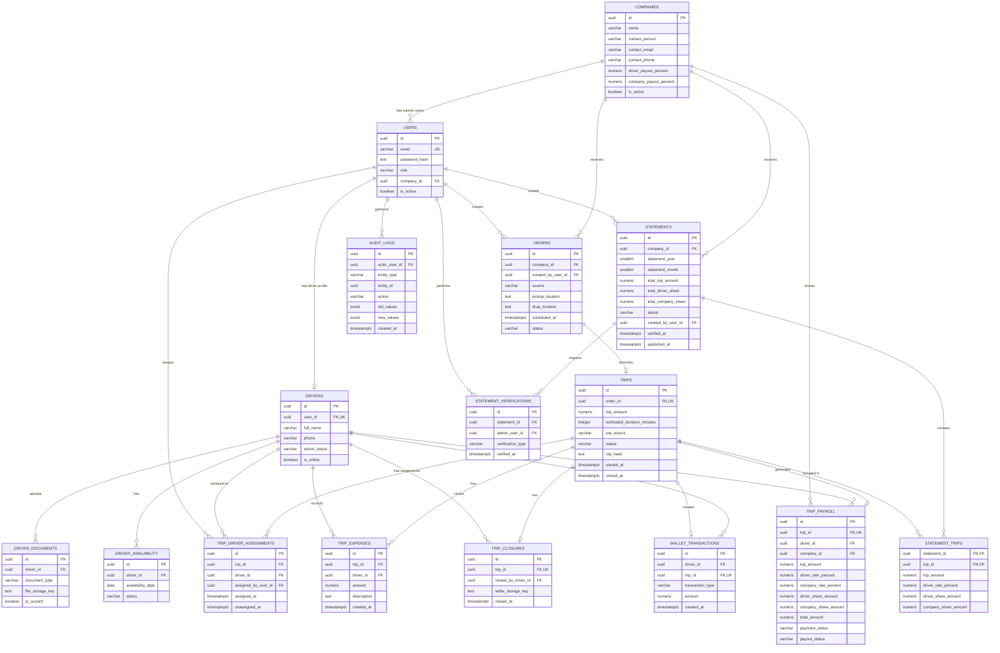

# HireD Phase 1 MVP — Database Design

## 1. Purpose

This document defines the relational database design for the HireD Phase 1 MVP based on the Product Requirements Document (PRD), Version 0.2, dated 30 Sep 2026.

The design is intended for **PostgreSQL** and covers:

- Entities and tables
- Columns and data types
- Primary keys
- Foreign keys
- Relationships and cardinality
- Constraints
- Indexes
- Normalization decisions
- ER diagram
- Important database design decisions

The PRD defines the product flow as:

**Order → Trip → Payout → Month-end Statement/Invoice → Two-person Verification → Published to Partner**

The PRD explicitly identifies the high-level entities Company, Order, Trip, Driver, Expense, Wallet Transaction, Trip Payroll Record, and Statement/Invoice. The detailed schema below expands these into the supporting tables required to implement authentication, documents, availability, assignments/reassignments, verification, and audit requirements.

---

## 2. Database Technology

| Item | Decision |
|---|---|
| Database | PostgreSQL |
| Database type | Relational |
| Normalization target | 3NF, with deliberate historical snapshots where required |
| ID strategy | UUID primary keys |
| Money type | `NUMERIC(12,2)` |
| Percentage type | `NUMERIC(5,2)` |
| Date/time | `TIMESTAMPTZ` |
| Boolean | `BOOLEAN` |
| JSON data | `JSONB` only where the structure is genuinely variable |
| Uploaded files | Store secure object-storage URL/key, not binary files in the database |

---

# 3. Entities

## 3.1 Core entities

| Entity | Purpose |
|---|---|
| `users` | Authentication identity for Admins, Partners and Drivers |
| `companies` | B2B partner companies |
| `drivers` | Driver-specific profile and operational information |
| `driver_documents` | Driver License, Aadhar, PAN and PCC documents |
| `driver_availability` | Driver online/offline and planned availability |
| `orders` | Orders/enquiries submitted by partners or entered by admins |
| `trips` | Accepted orders converted into operational trips |
| `trip_driver_assignments` | Driver assignment/reassignment history |
| `trip_expenses` | Expenses recorded during a trip |
| `trip_closures` | Trip-close information including OTP and selfie |
| `trip_payroll` | Snapshot of payout calculation for a closed trip |
| `wallet_transactions` | Driver wallet credits generated from completed trips |
| `statements` | Month-end company statement/invoice |
| `statement_trips` | Trips included in a statement |
| `statement_verifications` | Two-person verification records |
| `audit_logs` | Audit trail for important changes |

---

# 4. Relationships and Cardinality

| Relationship | Cardinality | Explanation |
|---|---|---|
| Company → Users | 1:N | A company can have partner users. |
| Company → Orders | 1:N | A company can create many orders. |
| Order → Trip | 1:0..1 | An order becomes a trip only after acceptance. |
| Driver → Driver Documents | 1:N | A driver can have multiple uploaded documents/versions. |
| Driver → Availability | 1:N | A driver can have multiple availability records. |
| Trip → Driver Assignments | 1:N | A trip can be assigned/reassigned multiple times. |
| Driver → Trip Assignments | 1:N | A driver can receive many trip assignments. |
| Trip → Expenses | 1:N | A trip can contain multiple expenses. |
| Trip → Closure | 1:0..1 | A trip has one closure record after successful closure. |
| Trip → Payroll | 1:0..1 | A payroll record is created when a trip closes. |
| Driver → Wallet Transactions | 1:N | A driver can have many wallet transactions. |
| Trip → Wallet Transaction | 1:0..1 | A closed trip produces one wallet credit. |
| Company → Statements | 1:N | A company can have statements for many months. |
| Statement → Statement Trips | 1:N | A statement contains many closed trips. |
| Statement → Verifications | 1:N | A statement requires two verification records. |
| User → Audit Logs | 1:N | A user can perform many auditable actions. |

---

# 5. Detailed Table Design

## 5.1 `users`

Stores authentication identities for all application users.

The PRD has three application roles:

- Admin
- B2B Partner
- Driver

### Columns

| Column | Data type | Null | Key / Constraint | Description |
|---|---|---:|---|---|
| `id` | `UUID` | No | PK | User identifier |
| `email` | `VARCHAR(255)` | No | UNIQUE | Login email |
| `password_hash` | `TEXT` | No | | Secure password hash |
| `role` | `VARCHAR(20)` | No | CHECK | `ADMIN`, `PARTNER`, `DRIVER` |
| `company_id` | `UUID` | Yes | FK → `companies.id` | Required for partner users |
| `is_active` | `BOOLEAN` | No | DEFAULT TRUE | Account status |
| `created_at` | `TIMESTAMPTZ` | No | DEFAULT now() | Creation timestamp |
| `updated_at` | `TIMESTAMPTZ` | No | DEFAULT now() | Last update timestamp |

### Constraints

- `email` must be unique.
- `role` must be one of `ADMIN`, `PARTNER`, `DRIVER`.
- `company_id` is required when `role = PARTNER`.
- `company_id` should be NULL for Admin and Driver accounts unless the implementation intentionally associates drivers with a company.
- Passwords must never be stored as plaintext.

---

## 5.2 `companies`

Stores B2B partner company information and the current payout split.

| Column | Data type | Null | Key / Constraint | Description |
|---|---|---:|---|---|
| `id` | `UUID` | No | PK | Company identifier |
| `name` | `VARCHAR(255)` | No | | Company name |
| `contact_person` | `VARCHAR(150)` | No | | Main contact person |
| `contact_email` | `VARCHAR(255)` | Yes | | Contact email |
| `contact_phone` | `VARCHAR(30)` | Yes | | Contact phone |
| `address_line1` | `VARCHAR(255)` | Yes | | Address |
| `address_line2` | `VARCHAR(255)` | Yes | | Address |
| `city` | `VARCHAR(100)` | Yes | | City |
| `state` | `VARCHAR(100)` | Yes | | State |
| `postal_code` | `VARCHAR(20)` | Yes | | Postal code |
| `country` | `VARCHAR(100)` | Yes | | Country |
| `driver_payout_percent` | `NUMERIC(5,2)` | No | CHECK | Current driver share |
| `company_payout_percent` | `NUMERIC(5,2)` | No | CHECK | Current company share |
| `is_active` | `BOOLEAN` | No | DEFAULT TRUE | Company status |
| `created_at` | `TIMESTAMPTZ` | No | DEFAULT now() | Creation timestamp |
| `updated_at` | `TIMESTAMPTZ` | No | DEFAULT now() | Last update timestamp |

### Important constraint

```text
driver_payout_percent + company_payout_percent = 100.00
```

The percentages must each be between 0 and 100.

### Important design note

The PRD says payout rates can be edited later and that the rate applies to trips closed after the change. Therefore, the **current rate belongs on `companies`**, while the **rate actually applied to each closed trip is stored in `trip_payroll`**.

---

## 5.3 `drivers`

Stores driver profile and onboarding status.

| Column | Data type | Null | Key / Constraint | Description |
|---|---|---:|---|---|
| `id` | `UUID` | No | PK | Driver identifier |
| `user_id` | `UUID` | No | UNIQUE, FK → `users.id` | Driver login account |
| `full_name` | `VARCHAR(150)` | No | | Driver name |
| `phone` | `VARCHAR(30)` | Yes | | Driver phone |
| `active_status` | `VARCHAR(20)` | No | CHECK | `PENDING`, `ACTIVE`, `INACTIVE` |
| `is_online` | `BOOLEAN` | No | DEFAULT FALSE | Current online/offline state |
| `created_at` | `TIMESTAMPTZ` | No | DEFAULT now() | Creation timestamp |
| `updated_at` | `TIMESTAMPTZ` | No | DEFAULT now() | Last update timestamp |

The PRD says Admin can mark a driver **Active** after onboarding. There is no formal document verification workflow in Phase 1.

---

## 5.4 `driver_documents`

Stores uploaded driver documents.

Required Phase 1 document types:

- Driver License
- Aadhar Card
- PAN Card
- Police Clearance Certificate (PCC)

| Column | Data type | Null | Key / Constraint | Description |
|---|---|---:|---|---|
| `id` | `UUID` | No | PK | Document record |
| `driver_id` | `UUID` | No | FK → `drivers.id` | Owner |
| `document_type` | `VARCHAR(30)` | No | CHECK | Document type |
| `file_storage_key` | `TEXT` | No | | Secure object storage key/path |
| `uploaded_at` | `TIMESTAMPTZ` | No | DEFAULT now() | Upload time |
| `is_current` | `BOOLEAN` | No | DEFAULT TRUE | Current version |
| `created_at` | `TIMESTAMPTZ` | No | DEFAULT now() | Creation timestamp |

### Constraint

A driver may upload newer versions of a document. Only one version of a given document type should be current.

---

## 5.5 `driver_availability`

Stores planned availability/unavailability dates.

| Column | Data type | Null | Key / Constraint | Description |
|---|---|---:|---|---|
| `id` | `UUID` | No | PK | Availability record |
| `driver_id` | `UUID` | No | FK → `drivers.id` | Driver |
| `availability_date` | `DATE` | No | | Date |
| `status` | `VARCHAR(20)` | No | CHECK | `AVAILABLE` or `UNAVAILABLE` |
| `created_at` | `TIMESTAMPTZ` | No | DEFAULT now() | Creation time |
| `updated_at` | `TIMESTAMPTZ` | No | DEFAULT now() | Last update |

### Constraint

```text
UNIQUE(driver_id, availability_date)
```

This prevents two conflicting availability records for the same driver and date.

---

## 5.6 `orders`

Represents an order/enquiry before it becomes a trip.

The order can originate from:

- B2B portal
- Admin entry for phone/WhatsApp requests

| Column | Data type | Null | Key / Constraint | Description |
|---|---|---:|---|---|
| `id` | `UUID` | No | PK | Order identifier |
| `company_id` | `UUID` | No | FK → `companies.id` | Partner company |
| `created_by_user_id` | `UUID` | No | FK → `users.id` | User who entered the order |
| `source` | `VARCHAR(20)` | No | CHECK | `PORTAL` or `ADMIN` |
| `pickup_location` | `TEXT` | No | | Pickup |
| `drop_location` | `TEXT` | No | | Drop |
| `scheduled_at` | `TIMESTAMPTZ` | No | | Requested date/time |
| `vehicle_service_notes` | `TEXT` | Yes | | Vehicle/service requirements |
| `contact_name` | `VARCHAR(150)` | Yes | | Trip contact |
| `contact_phone` | `VARCHAR(30)` | Yes | | Trip contact phone |
| `status` | `VARCHAR(20)` | No | CHECK | `RECEIVED`, `ACCEPTED`, `REJECTED` |
| `rejection_reason` | `TEXT` | Yes | | Reason for rejection |
| `created_at` | `TIMESTAMPTZ` | No | DEFAULT now() | Creation timestamp |
| `updated_at` | `TIMESTAMPTZ` | No | DEFAULT now() | Last update |

### Important decision

The order remains separate from the trip because the PRD explicitly describes an order being accepted and then becoming a trip.

---

## 5.7 `trips`

Stores the operational trip created from an accepted order.

| Column | Data type | Null | Key / Constraint | Description |
|---|---|---:|---|---|
| `id` | `UUID` | No | PK | Trip identifier |
| `order_id` | `UUID` | No | UNIQUE, FK → `orders.id` | Source order |
| `trip_amount` | `NUMERIC(12,2)` | No | CHECK >= 0 | Total trip amount |
| `estimated_duration_minutes` | `INTEGER` | Yes | CHECK >= 0 | ETA/duration |
| `eta_source` | `VARCHAR(20)` | Yes | CHECK | `MAPS`, `ADMIN_OVERRIDE` |
| `status` | `VARCHAR(20)` | No | CHECK | `UNASSIGNED`, `ASSIGNED`, `ONGOING`, `CLOSED` |
| `otp_hash` | `TEXT` | Yes | | Hashed trip-close OTP |
| `otp_expires_at` | `TIMESTAMPTZ` | Yes | | OTP expiry |
| `created_at` | `TIMESTAMPTZ` | No | DEFAULT now() | Creation timestamp |
| `started_at` | `TIMESTAMPTZ` | Yes | | Trip start |
| `closed_at` | `TIMESTAMPTZ` | Yes | | Trip close |
| `updated_at` | `TIMESTAMPTZ` | No | DEFAULT now() | Last update |

### Constraints

- `order_id` is unique because Phase 1 has one trip per accepted order.
- `trip_amount >= 0`.
- `started_at` should be set when status becomes `ONGOING`.
- `closed_at` should be set when status becomes `CLOSED`.
- An OTP must not be stored as plaintext.

---

## 5.8 `trip_driver_assignments`

Stores the assignment history because Admin can reassign a driver at any time.

| Column | Data type | Null | Key / Constraint | Description |
|---|---|---:|---|---|
| `id` | `UUID` | No | PK | Assignment identifier |
| `trip_id` | `UUID` | No | FK → `trips.id` | Trip |
| `driver_id` | `UUID` | No | FK → `drivers.id` | Assigned driver |
| `assigned_by_user_id` | `UUID` | No | FK → `users.id` | Admin who assigned |
| `assigned_at` | `TIMESTAMPTZ` | No | DEFAULT now() | Assignment time |
| `unassigned_at` | `TIMESTAMPTZ` | Yes | | End of assignment |

### Important design decision

Do **not** put only `driver_id` on `trips`.

The PRD explicitly says the Admin can reassign a driver at any time. An assignment-history table preserves:

- Who was assigned
- Who made the assignment
- When the assignment started
- When it ended

The currently assigned driver can be obtained from the assignment whose `unassigned_at IS NULL`.

---

## 5.9 `trip_closures`

Stores data generated during successful trip closure.

| Column | Data type | Null | Key / Constraint | Description |
|---|---|---:|---|---|
| `id` | `UUID` | No | PK | Closure identifier |
| `trip_id` | `UUID` | No | UNIQUE, FK → `trips.id` | Closed trip |
| `closed_by_driver_id` | `UUID` | No | FK → `drivers.id` | Driver who closed it |
| `selfie_storage_key` | `TEXT` | Yes | | Selfie object-storage key |
| `closed_at` | `TIMESTAMPTZ` | No | DEFAULT now() | Closure time |

One trip can have at most one successful closure.

---

## 5.10 `trip_expenses`

Stores expenses recorded before a trip is closed.

| Column | Data type | Null | Key / Constraint | Description |
|---|---|---:|---|---|
| `id` | `UUID` | No | PK | Expense identifier |
| `trip_id` | `UUID` | No | FK → `trips.id` | Trip |
| `driver_id` | `UUID` | No | FK → `drivers.id` | Driver who logged it |
| `amount` | `NUMERIC(12,2)` | No | CHECK > 0 | Expense amount |
| `description` | `TEXT` | No | | Expense description |
| `created_at` | `TIMESTAMPTZ` | No | DEFAULT now() | Creation time |

### Important decision

Expenses are separate from payroll because the PRD says expenses are shown in the trip report and are not part of the commission split.

The PRD currently lists this as an assumption, so reimbursement behavior should not be built into this schema unless the team confirms it.

---

## 5.11 `trip_payroll`

Stores the final payout calculation for a closed trip.

| Column | Data type | Null | Key / Constraint | Description |
|---|---|---:|---|---|
| `id` | `UUID` | No | PK | Payroll record |
| `trip_id` | `UUID` | No | UNIQUE, FK → `trips.id` | Trip |
| `driver_id` | `UUID` | No | FK → `drivers.id` | Driver |
| `company_id` | `UUID` | No | FK → `companies.id` | B2B company |
| `trip_amount` | `NUMERIC(12,2)` | No | CHECK >= 0 | Trip amount snapshot |
| `driver_rate_percent` | `NUMERIC(5,2)` | No | CHECK 0..100 | Rate used |
| `company_rate_percent` | `NUMERIC(5,2)` | No | CHECK 0..100 | Rate used |
| `driver_share_amount` | `NUMERIC(12,2)` | No | CHECK >= 0 | Driver payout |
| `company_share_amount` | `NUMERIC(12,2)` | No | CHECK >= 0 | Company share |
| `total_amount` | `NUMERIC(12,2)` | No | CHECK >= 0 | Payroll total |
| `payment_status` | `VARCHAR(20)` | No | CHECK | `PENDING`, `SETTLED` |
| `payout_status` | `VARCHAR(20)` | No | CHECK | `PENDING`, `CREDITED` |
| `calculated_at` | `TIMESTAMPTZ` | No | DEFAULT now() | Calculation time |

### Critical constraints

```text
driver_rate_percent + company_rate_percent = 100.00

driver_share_amount + company_share_amount = total_amount

total_amount = trip_amount
```

### Why store the rate here?

The PRD explicitly states:

> Each trip stores the rate applied at close, so later rate edits never change past trips.

Therefore, referencing the current company percentage from `companies` is not sufficient.

---

## 5.12 `wallet_transactions`

Stores driver wallet movements.

| Column | Data type | Null | Key / Constraint | Description |
|---|---|---:|---|---|
| `id` | `UUID` | No | PK | Wallet transaction |
| `driver_id` | `UUID` | No | FK → `drivers.id` | Driver |
| `trip_id` | `UUID` | Yes | UNIQUE, FK → `trips.id` | Source trip |
| `transaction_type` | `VARCHAR(20)` | No | CHECK | `TRIP_CREDIT` |
| `amount` | `NUMERIC(12,2)` | No | CHECK > 0 | Credit amount |
| `created_at` | `TIMESTAMPTZ` | No | DEFAULT now() | Credit time |

### Important constraint

For Phase 1, a closed trip must generate **at most one** wallet credit.

A unique constraint on `trip_id` prevents duplicate wallet credits caused by retrying the trip-close operation.

### Wallet balance

Do not store a mutable `wallet_balance` as the primary source of truth in Phase 1. The balance can be calculated as:

```sql
SUM(wallet_transactions.amount)
```

For future scale, a cached balance can be introduced with transactional safeguards.

---

## 5.13 `statements`

Represents a month-end statement/invoice for one company and one calendar month.

| Column | Data type | Null | Key / Constraint | Description |
|---|---|---:|---|---|
| `id` | `UUID` | No | PK | Statement identifier |
| `company_id` | `UUID` | No | FK → `companies.id` | Partner company |
| `statement_year` | `SMALLINT` | No | | Calendar year |
| `statement_month` | `SMALLINT` | No | CHECK 1..12 | Calendar month |
| `total_trip_amount` | `NUMERIC(12,2)` | No | CHECK >= 0 | Monthly total |
| `total_driver_share` | `NUMERIC(12,2)` | No | CHECK >= 0 | Driver share total |
| `total_company_share` | `NUMERIC(12,2)` | No | CHECK >= 0 | Company share total |
| `status` | `VARCHAR(30)` | No | CHECK | `DRAFT`, `PENDING_VERIFICATION`, `VERIFIED`, `PUBLISHED` |
| `created_by_user_id` | `UUID` | No | FK → `users.id` | Statement creator |
| `created_at` | `TIMESTAMPTZ` | No | DEFAULT now() | Creation time |
| `verified_at` | `TIMESTAMPTZ` | Yes | | Verification completion time |
| `published_at` | `TIMESTAMPTZ` | Yes | | Partner publication time |

### Constraint

```text
UNIQUE(company_id, statement_year, statement_month)
```

This prevents duplicate statements for the same company/month.

---

## 5.14 `statement_trips`

Associates closed trips with a month-end statement.

| Column | Data type | Null | Key / Constraint | Description |
|---|---|---:|---|---|
| `statement_id` | `UUID` | No | PK/FK → `statements.id` | Statement |
| `trip_id` | `UUID` | No | PK/FK → `trips.id` | Included trip |
| `trip_amount` | `NUMERIC(12,2)` | No | | Snapshot |
| `driver_rate_percent` | `NUMERIC(5,2)` | No | | Applied rate |
| `driver_share_amount` | `NUMERIC(12,2)` | No | | Driver share |
| `company_share_amount` | `NUMERIC(12,2)` | No | | Company share |

### Why keep snapshots here?

`trip_payroll` already contains the authoritative payroll calculation. These fields are useful as a statement snapshot if statements must remain immutable after generation.

If the implementation guarantees that statements always query immutable `trip_payroll` records, these duplicated snapshot columns can be omitted. This is a deliberate denormalization option rather than a 3NF requirement.

---

## 5.15 `statement_verifications`

Records the two-person verification.

| Column | Data type | Null | Key / Constraint | Description |
|---|---|---:|---|---|
| `id` | `UUID` | No | PK | Verification record |
| `statement_id` | `UUID` | No | FK → `statements.id` | Statement |
| `admin_user_id` | `UUID` | No | FK → `users.id` | Admin verifier |
| `verification_type` | `VARCHAR(20)` | No | CHECK | `CREATOR`, `SECOND_REVIEWER` |
| `verified_at` | `TIMESTAMPTZ` | No | DEFAULT now() | Verification time |

### Constraints

- `admin_user_id` must refer to an Admin user.
- A statement requires exactly two verification records before it can become `VERIFIED`.
- The two verification users must be different.
- One must be the statement creator.
- The second must be another Admin.

This is better than storing `verifier_1_id` and `verifier_2_id` directly on `statements` because verification is an event/history and deserves its own table.

---

## 5.16 `audit_logs`

Stores audit records for important changes.

The PRD explicitly requires auditing:

- Company payout split changes
- Trip amount changes
- Driver reassignment
- Invoice verification

| Column | Data type | Null | Key / Constraint | Description |
|---|---|---:|---|---|
| `id` | `UUID` | No | PK | Audit identifier |
| `actor_user_id` | `UUID` | No | FK → `users.id` | User performing action |
| `entity_type` | `VARCHAR(50)` | No | | Entity affected |
| `entity_id` | `UUID` | No | | Affected record |
| `action` | `VARCHAR(50)` | No | | Action performed |
| `old_values` | `JSONB` | Yes | | Previous values |
| `new_values` | `JSONB` | Yes | | New values |
| `created_at` | `TIMESTAMPTZ` | No | DEFAULT now() | Audit timestamp |

### Example

```json
{
  "entity_type": "TRIP",
  "action": "AMOUNT_UPDATED",
  "old_values": {
    "trip_amount": 8000
  },
  "new_values": {
    "trip_amount": 10000
  }
}
```

`JSONB` is appropriate here because audit payload structure differs between audited entities.

---

# 6. ER Diagram

The following Mermaid ER diagram can be rendered by Markdown tools that support Mermaid.



---

# 7. Indexes

Indexes should support the application's most common queries rather than indexing every column.

## Recommended indexes

| Table | Index | Reason |
|---|---|---|
| `users` | UNIQUE(`email`) | Login lookup |
| `users` | (`company_id`, `role`) | Partner/company user filtering |
| `orders` | (`company_id`, `status`, `created_at`) | Partner order list |
| `orders` | (`status`, `created_at`) | Admin order inbox |
| `trips` | (`status`, `created_at`) | Ongoing/closed trip queries |
| `trips` | (`order_id`) | Order → trip lookup; unique already covers this |
| `trip_driver_assignments` | (`trip_id`, `unassigned_at`) | Find current assignment |
| `trip_driver_assignments` | (`driver_id`, `unassigned_at`) | Driver's current assignments |
| `trip_expenses` | (`trip_id`, `created_at`) | Trip expense list |
| `trip_payroll` | (`driver_id`, `calculated_at`) | Driver payout reports |
| `trip_payroll` | (`company_id`, `calculated_at`) | Company/monthly reporting |
| `wallet_transactions` | (`driver_id`, `created_at`) | Wallet history |
| `statements` | (`company_id`, `statement_year`, `statement_month`) | Monthly statement lookup |
| `statements` | (`status`, `created_at`) | Admin verification queue |
| `statement_trips` | (`trip_id`) | Find statement containing a trip |
| `statement_verifications` | (`statement_id`) | Verification lookup |
| `audit_logs` | (`entity_type`, `entity_id`, `created_at`) | Entity audit history |
| `audit_logs` | (`actor_user_id`, `created_at`) | User activity history |

### Partial index recommendation

For PostgreSQL, the current assignment can be queried efficiently with a partial index:

```sql
CREATE INDEX idx_current_trip_assignment
ON trip_driver_assignments (trip_id)
WHERE unassigned_at IS NULL;
```

Similarly:

```sql
CREATE INDEX idx_current_driver_assignment
ON trip_driver_assignments (driver_id)
WHERE unassigned_at IS NULL;
```

---

# 8. Constraints and Business Rules

## 8.1 Company payout split

```text
0 <= driver_payout_percent <= 100
0 <= company_payout_percent <= 100
driver_payout_percent + company_payout_percent = 100
```

---

## 8.2 Trip lifecycle

```text
UNASSIGNED
    ↓
ASSIGNED
    ↓
ONGOING
    ↓
CLOSED
```

A trip should not move backwards from `CLOSED`.

---

## 8.3 Order lifecycle

```text
RECEIVED → ACCEPTED
RECEIVED → REJECTED
```

Only an accepted order can create a trip.

---

## 8.4 Trip closure

The PRD requires:

1. Expenses are logged.
2. Driver enters the correct OTP.
3. Trip closes.
4. Trip report is generated.
5. Driver payout is calculated.
6. Wallet is credited.

The database should enforce the **data integrity** of this flow, while the application/service layer should coordinate the transaction.

---

## 8.5 Wallet idempotency

The payout process must run exactly once.

The following relationship is therefore enforced:

```text
One closed trip → maximum one TRIP_CREDIT wallet transaction
```

A unique constraint on `wallet_transactions.trip_id` provides database-level protection against duplicate wallet credits.

---

## 8.6 Statement verification

A statement cannot become `PUBLISHED` until:

- The creator has verified it.
- A different Admin has verified it.
- Both verification records exist.

This rule should be enforced primarily by the service layer/database transaction because it involves multiple rows.

---

# 9. Normalization Decisions

## 9.1 Target: Third Normal Form (3NF)

The schema is designed primarily in 3NF.

### First Normal Form

Each column contains an atomic value.

For example, instead of:

```text
documents = "license.pdf, pan.pdf, aadhar.pdf"
```

documents are stored as individual records in:

```text
driver_documents
```

---

### Second Normal Form

Non-key attributes depend on the complete primary key.

For example, `statement_trips` has a composite primary key:

```text
(statement_id, trip_id)
```

The relationship itself is represented separately rather than storing a list of trip IDs inside `statements`.

---

### Third Normal Form

Non-key attributes depend on the key, the whole key, and nothing but the key.

For example:

```text
companies
    ├── company details
    └── current payout configuration

drivers
    ├── driver details
    └── driver documents in driver_documents
```

Driver documents are not repeated as columns such as:

```text
license_file
pan_file
aadhar_file
pcc_file
```

because the document data belongs to a separate repeating entity.

---

# 10. Deliberate Historical Snapshots

Some data is intentionally duplicated because the application needs historical correctness.

## 10.1 Payroll rate snapshot

`companies` stores the **current** payout rate.

`trip_payroll` stores the **rate actually used** for a closed trip.

Example:

```text
Company current rate:
Driver = 30%
Company = 70%

Trip A closes:
Driver = 30%
Company = 70%

Admin later changes company rate:
Driver = 40%
Company = 60%

Trip A must remain:
Driver = 30%
Company = 70%
```

This is intentional denormalization for historical integrity.

---

## 10.2 Statement snapshot

A statement may preserve trip/payroll values at the time the statement was generated.

This protects published statements from changing if future reporting logic changes.

If `trip_payroll` is treated as immutable after trip closure, the application can instead calculate statement totals directly from it and avoid duplicating those values in `statement_trips`.

---

# 11. Important Database Design Decisions

## 11.1 Order and Trip are separate tables

An order is a request.

A trip is an accepted operational job.

Therefore:

```text
Order 1 ───── 0..1 Trip
```

A rejected order has no trip.

---

## 11.2 Driver assignment has its own table

The PRD allows Admin to reassign drivers at any time.

Therefore, storing only:

```text
trips.driver_id
```

would lose assignment history.

The assignment table preserves the complete assignment timeline.

---

## 11.3 Current company rate vs applied trip rate

The company table stores the rate currently configured by Admin.

The payroll table stores the rate actually used when a trip closes.

This prevents later payroll-setting changes from altering historical payouts.

---

## 11.4 Wallet is transaction-based

A wallet transaction is created when a trip closes.

The wallet does not need to store a manually edited balance as the authoritative value.

The transaction ledger provides traceability:

```text
Trip closed
    ↓
Trip payroll calculated
    ↓
Wallet transaction created
    ↓
Driver wallet balance = sum of wallet transactions
```

---

## 11.5 OTP is not stored as plaintext

The PRD requires a numeric OTP for closing a trip.

The database should store an `otp_hash`, not the original OTP.

The partner portal can display the generated OTP to the authorized partner user, while the driver submits the OTP through the mobile app.

---

## 11.6 Files are not stored directly in PostgreSQL

Driver documents and selfies should be stored in secure object storage.

The database stores the storage key/reference:

```text
file_storage_key
selfie_storage_key
```

This keeps the relational database smaller and allows appropriate file access controls.

---

## 11.7 Audit logs are separate

Important changes should not overwrite history.

For example, if an Admin changes:

```text
₹8,000 → ₹10,000
```

the current trip stores ₹10,000, while the audit log preserves the previous and new values.

---

## 11.8 Authentication and business profile are separated

`users` represents authentication and authorization identity.

`drivers` represents driver-specific business information.

`companies` represents B2B partner information.

This avoids putting unrelated fields into a single large user table.

---

# 12. PostgreSQL Constraint Examples

These examples illustrate important database-level constraints.

```sql
CHECK (driver_payout_percent >= 0
   AND driver_payout_percent <= 100);

CHECK (company_payout_percent >= 0
   AND company_payout_percent <= 100);

CHECK (
    driver_payout_percent + company_payout_percent = 100
);

CHECK (trip_amount >= 0);

CHECK (
    driver_rate_percent + company_rate_percent = 100
);

CHECK (
    driver_share_amount + company_share_amount = total_amount
);
```

For monthly statements:

```sql
UNIQUE (
    company_id,
    statement_year,
    statement_month
);
```

For driver availability:

```sql
UNIQUE (
    driver_id,
    availability_date
);
```

For one trip per accepted order:

```sql
UNIQUE (order_id);
```

For one wallet credit per trip:

```sql
UNIQUE (trip_id);
```

---

# 13. Transaction Boundary for Trip Closure

Trip closure is the most important database transaction in Phase 1.

A simplified transaction should behave like:

```text
BEGIN

1. Lock the trip row
2. Verify trip status is ONGOING
3. Verify required expenses have been recorded
4. Verify supplied OTP
5. Mark trip CLOSED
6. Create trip_closures record
7. Read the company's current payout rate
8. Create trip_payroll snapshot
9. Create wallet_transactions credit
10. Generate/update trip report data

COMMIT
```

If any critical step fails:

```text
ROLLBACK
```

This is important because the PRD requires the payout calculation to run exactly once per closed trip.

---

# 14. Statement Generation Flow

For a company and calendar month:

```text
Find all CLOSED trips
        ↓
Find their TRIP_PAYROLL records
        ↓
Create STATEMENT
        ↓
Add trips to STATEMENT_TRIPS
        ↓
Calculate monthly totals
        ↓
PENDING_VERIFICATION
        ↓
Creator verifies
        ↓
Second Admin verifies
        ↓
VERIFIED
        ↓
PUBLISHED
        ↓
Partner can view it
```

Payment itself is outside the database/application scope because the PRD states that payment is settled directly between HireD and the partner.

---

# 15. Data Access Boundaries

The database schema should support the application's authorization rules, while authorization itself should be implemented in the application/service layer.

## Partner

A partner user should only access:

```text
their company
    ↓
their orders
    ↓
their trips
    ↓
their trip reports
    ↓
their verified/published statements
```

## Driver

A driver should only access:

```text
their profile
their documents
their availability
their assigned trips
their expenses
their wallet transactions
```

## Admin

Admins have full Phase 1 visibility according to the PRD.

All Admin accounts have the same access because Phase 1 has no permission tiers.

---

# 16. Tables Summary

| # | Table | Main responsibility |
|---:|---|---|
| 1 | `users` | Authentication and role |
| 2 | `companies` | B2B partner and current payout split |
| 3 | `drivers` | Driver profile |
| 4 | `driver_documents` | Driver uploaded documents |
| 5 | `driver_availability` | Planned availability |
| 6 | `orders` | Incoming order/enquiry |
| 7 | `trips` | Accepted operational trip |
| 8 | `trip_driver_assignments` | Assignment/reassignment history |
| 9 | `trip_closures` | Successful trip closure |
| 10 | `trip_expenses` | Trip expenses |
| 11 | `trip_payroll` | Final payout calculation |
| 12 | `wallet_transactions` | Driver wallet ledger |
| 13 | `statements` | Monthly company statement |
| 14 | `statement_trips` | Trips included in statements |
| 15 | `statement_verifications` | Two-person verification |
| 16 | `audit_logs` | Audit trail |

---

# 17. Requirements-to-Database Mapping

| PRD requirement | Database support |
|---|---|
| B2B partner login | `users`, `companies` |
| Partner sees own company data | `users.company_id` + application authorization |
| Create order | `orders` |
| Admin-created phone/WhatsApp order | `orders.source = ADMIN` |
| Order acceptance/rejection | `orders.status` |
| Accepted order becomes trip | `trips.order_id` |
| Driver onboarding | `drivers`, `driver_documents` |
| Driver availability | `drivers.is_online`, `driver_availability` |
| Driver assignment | `trip_driver_assignments` |
| Driver reassignment | `trip_driver_assignments` history |
| ETA | `trips.estimated_duration_minutes`, `eta_source` |
| Selfie | `trip_closures.selfie_storage_key` |
| Trip expenses | `trip_expenses` |
| OTP close | `trips.otp_hash`, `trips.otp_expires_at` |
| Trip payroll | `trip_payroll` |
| Driver wallet | `wallet_transactions` |
| Month-end statement | `statements`, `statement_trips` |
| Two-person verification | `statement_verifications` |
| Published partner statement | `statements.status` |
| Audit requirements | `audit_logs` |
| Secure document storage | storage keys in `driver_documents` |
| No duplicate wallet credit | unique `wallet_transactions.trip_id` |

---

# 18. Open Questions That Affect the Database

The PRD still contains several open questions/assumptions. These should be resolved before treating the schema as final.

## 18.1 Trip pricing

The PRD asks:

> Who decides the trip price before Admin confirms it: the partner, or Admin alone?

Current design assumes Admin ultimately controls the confirmed `trip_amount`.

---

## 18.2 Expense reimbursement

The PRD asks whether expenses are reimbursed and how.

Current design only records expenses. It does **not** create reimbursement or expense-payout tables.

If reimbursement is later required, it should be modeled separately.

---

## 18.3 Notifications

The PRD mentions possible email/push/SMS alerts but does not define all notification events.

No notification table is required for the Phase 1 core data model yet.

---

## 18.4 No-driver scenario

The PRD asks what happens if no driver is available.

The current schema does not introduce a special order/trip status for this because the workflow has not been confirmed.

---

## 18.5 Live trip report

The PRD asks what "live" means.

Current design supports querying trips with:

```text
status = ONGOING
```

If real-time location tracking is added later, a separate trip-location/event model will be required.

---

# 19. Final Design Principles

The most important principles of this database design are:

1. **Use PostgreSQL relational tables for transactional data.**
2. **Keep Order and Trip separate.**
3. **Keep driver assignment history instead of storing only the current driver.**
4. **Store the payout rate snapshot on each trip payroll record.**
5. **Treat wallet credits as ledger transactions.**
6. **Use database constraints to prevent duplicate wallet credits.**
7. **Store driver documents/selfies in secure object storage and keep references in PostgreSQL.**
8. **Represent two-person statement verification as separate records.**
9. **Keep an audit trail for financially and operationally important changes.**
10. **Aim for 3NF, but deliberately preserve historical snapshots where business correctness requires them.**
11. **Keep unresolved PRD questions out of the schema until the business rule is confirmed.**
12. **Use database transactions for trip closure and payout creation so the operation is atomic.**

---

## 20. Source

This database design is derived from the HireD Phase 1 MVP Product Requirements Document, Version 0.2, dated 30 Sep 2026. The PRD defines the product vision, users, scope, end-to-end order/trip/payout/invoice flow, functional requirements, payroll rules, high-level data model, audit requirements, and open questions. 
